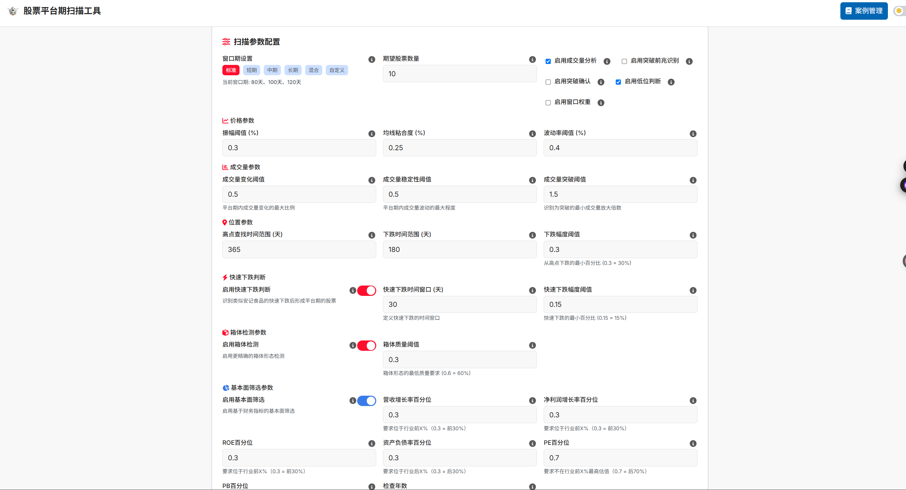
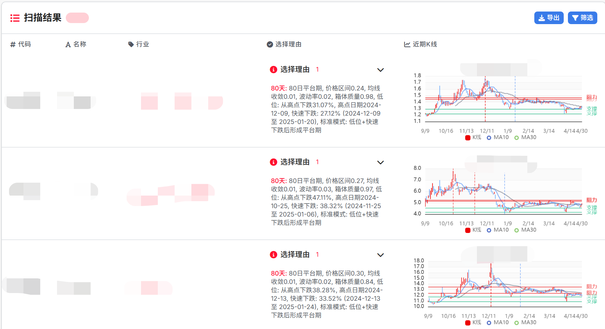

<div align="center">

# 📊 股票平台期扫描工具 📈


[](https://creativecommons.org/licenses/by-nc-sa/4.0/)
[](https://www.python.org/downloads/)
[](https://vuejs.org/)
[](https://fastapi.tiangolo.com/)


</div>

**⚠️ 免责声明：本项目仅用于教育目的，不构成任何投资建议。投资有风险，交易需谨慎。**

<div align="center">

</div>

## 项目概述

本项目是一个专注于股票平台期识别的扫描工具，能够通过技术分析方法自动识别处于平台期的股票，并提供可视化分析结果。

### 什么是平台期，为什么要做平台期检测？

**平台期**是指股票价格在一段时间内横向波动，形成相对稳定的上下边界（支撑位和阻力位）的时期。平台期通常代表了多空力量的暂时平衡，是市场决策的关键时期。

**平台期检测的重要性：**

<div align="center">
<table>
  <tr>
    <td align="center"><br><b>突破信号</b></td>
    <td align="center"><br><b>风险管理</b></td>
    <td align="center"><br><b>趋势转变</b></td>
  </tr>
  <tr>
    <td>平台期突破往往预示着新趋势的开始</td>
    <td>平台期的边界可以作为设置止损或止盈的参考点</td>
    <td>平台期的形成和突破可能标志着市场趋势的变化</td>
  </tr>
</table>
</div>

本工具采用多维度分析方法，结合均线分析、波动率检测、箱体识别和成交量分析等技术，全面评估股票的平台期特征，为投资决策提供技术参考。

<div align="center">

</div>

## 项目安装

## 🚀 快速部署（推荐）

### Docker 一键部署

```bash
# 1. 克隆项目
git clone https://github.com/your-username/a-share-platform-stocks-selection.git
cd a-share-platform-stocks-selection

# 2. 检查端口冲突（可选）
./check-ports.sh

# 3. 一键部署
./local-deploy.sh
```

访问地址：
- 前端：http://localhost:3000
- 后端 API：http://localhost:8001

### 开发环境安装

前端安装与启动:

```bash
# 根目录下执行
npm install
npm run dev
```

后端安装与启动:

```bash
# 进入api目录
cd api

# 安装依赖
pip install -r requirements.txt

# 启动服务
uvicorn index:app --reload --port 8001
```

## 数据来源

本项目使用 **Baostock** 作为数据源，在此对 Baostock 提供的优质数据服务表示诚挚的感谢。Baostock 提供了丰富的股票历史数据和基本面数据，为本项目的分析功能提供了坚实基础。

<div align="center">

</div>

## 项目预览

<div align="center">
  <p><b>系统界面预览</b></p>
  
  
  <p><b>分析结果展示</b></p>
  
</div>

<div align="center">

</div>

## 功能特点

<div align="center">
<table>
  <tr>
    <td align="center"><br><b>多窗口分析</b></td>
    <td align="center"><br><b>箱体检测</b></td>
    <td align="center"><br><b>低位分析</b></td>
  </tr>
  <tr>
    <td align="center"><br><b>突破预测</b></td>
    <td align="center"><br><b>案例管理</b></td>
    <td align="center"><br><b>可视化分析</b></td>
  </tr>
</table>
</div>

## 后端选股逻辑与参数设置说明

### 整体选股逻辑

股票平台期扫描工具使用多种过滤条件来识别处于平台期的股票。系统的核心逻辑如下：

1. **数据获取**：

   - 系统根据配置的窗口期自动计算回测时间范围
   - 结束日期默认为当前日期
   - 开始日期为当前日期减去最大窗口期的两倍天数
   - 使用 Baostock API 获取指定时间范围内的股票数据

2. **多重过滤机制**：

   - 系统采用"与"逻辑组合多个过滤条件
   - 股票必须通过所有启用的过滤条件才会被选中
   - 每个过滤条件都有独立的开关和参数设置

3. **主要过滤条件**：

   - **价格分析**：检查股票价格是否在指定窗口期内形成平台（振幅小、均线粘合、波动率低）
   - **成交量分析**：检查成交量是否在平台期内保持稳定
   - **低位分析**：检查股票是否从历史高点大幅下跌
   - **快速下跌分析**：检查股票是否经历过短期内的快速下跌
   - **箱体检测**：检查股票价格是否形成明显的支撑位和阻力位
   - **突破预测**：预测股票是否即将突破平台期
   - **窗口权重**：对不同窗口期的分析结果进行加权

4. **行业多样性**：
   - 系统默认启用行业多样性过滤
   - 确保选出的股票来自不同行业，避免行业集中风险

### 回测时间设置

在系统中，回测区间（日期范围）是通过以下方式设置和传递的：

1. **回测区间的自动计算**：

   ```python
   # 计算日期范围
   end_date = datetime.now().strftime('%Y-%m-%d')  # 使用当前日期作为结束日期
   # 使用最大窗口大小加上一些缓冲天数作为起始日期
   max_window = max(config.windows) if config.windows else 90
   start_date = (datetime.now() - timedelta(days=max_window * 2)).strftime('%Y-%m-%d')
   ```

2. **数据获取过程**：

   - 回测区间参数在数据获取阶段被使用
   - `fetch_kline_data`函数接收这些日期参数并从 Baostock API 获取数据

3. **分析过程**：

   - 获取到的数据（DataFrame）被传递给各个分析函数
   - 回测区间参数本身不会传递给分析函数
   - 各个分析函数使用相对参数（如 lookback_days, window 等）来处理数据

4. **各个过滤条件的数据处理方式**：
   - **低位分析**：使用`high_point_lookback_days`参数在 DataFrame 中查找高点
   - **快速下跌分析**：使用`lookback_days`和`rapid_decline_days`参数在 DataFrame 中分析下跌特征
   - **价格分析**：使用`window`参数获取最近的数据进行分析

### 快速下跌参数设置

快速下跌分析使用以下参数：

1. **lookback_days**：

   - 默认值为 365 天（查找历史高点的时间范围）
   - 前端界面没有提供填写框让用户修改这个参数
   - 这是一个固定参数，系统认为高点查找范围应该是一年

2. **decline_period_days**：

   - 默认值为 180 天（下跌应该发生的时间范围）
   - 前端界面同样没有提供修改选项

3. **rapid_decline_days**：

   - 默认值为 30 天（定义快速下跌的时间窗口）
   - 前端界面允许用户修改这个参数

4. **rapid_decline_threshold**：
   - 默认值为 0.15（15%，判定为快速下跌的最小下跌幅度）
   - 前端界面允许用户修改这个参数

### 窗口期设置

前端的窗口期设置（如"80,100,120"）用于以下几个方面：

1. **多窗口分析**：

   - 系统会使用这些窗口期分别进行平台期分析
   - 如果任何一个窗口期满足条件，则认为股票处于平台期

2. **为什么要填三组窗口**：

   - **多维度验证**：不同的窗口期可以从不同的时间尺度验证平台期特征
   - **灵敏度平衡**：短窗口期对近期变化更敏感，长窗口期更稳定
   - **互补性**：多个窗口期互相补充，提高识别准确性
   - **适应不同股票**：不同股票的平台期长度可能不同，多窗口可以适应这种差异

3. **窗口期的使用**：
   ```python
   for window in windows:
       # Price analysis
       price_analysis = analyze_price(
           df, window, box_threshold, ma_diff_threshold, volatility_threshold
       )
       # ...其他分析
   ```

### 箱体检测参数设置

箱体检测的参数设置如下：

1. **回测时间**：

   - 箱体检测没有专门的回测时间设置
   - 使用系统自动计算的回测时间范围
   - 与其他分析方法使用相同的时间范围，确保分析的一致性

2. **窗口期**：

   - 箱体检测使用最大窗口进行分析

   ```python
   # 使用最大窗口进行箱体检测，以获取更稳定的支撑位和阻力位
   max_window = max(windows) if windows else 90
   box_analysis = analyze_box_pattern(df, max_window)
   ```

3. **质量阈值**：
   - 前端界面允许用户设置箱体质量阈值
   - 用于判断箱体的清晰度和可靠性

### 低位分析与快速下跌分析的区别

1. **低位判断 (analyze_position)**：

   - **目的**：判断股票是否处于相对历史高点的低位
   - **主要参数**：
     - `high_point_lookback_days`：查找历史高点的时间范围（默认 365 天）
     - `decline_period_days`：下跌应该发生的时间范围（默认 180 天）
     - `decline_threshold`：判定为低位的最小下跌幅度（默认 0.3，即 30%）
   - **判断逻辑**：
     - 找出历史高点
     - 计算当前价格与历史高点的跌幅
     - 判断跌幅是否超过阈值且下跌发生在指定时间范围内

2. **快速下跌判断 (analyze_decline_speed)**：

   - **目的**：判断股票是否经历了快速下跌
   - **主要参数**：
     - `rapid_decline_days`：定义快速下跌的时间窗口（默认 30 天）
     - `rapid_decline_threshold`：判定为快速下跌的最小下跌幅度（默认 0.15，即 15%）
   - **判断逻辑**：
     - 在历史数据中寻找最大的快速下跌窗口
     - 计算该窗口内的下跌幅度
     - 判断下跌幅度是否超过阈值

3. **两者的区别**：

   - **时间范围不同**：低位判断关注较长时间范围，快速下跌判断关注较短时间窗口
   - **下跌幅度要求不同**：低位判断要求较大的下跌幅度，快速下跌判断要求较小的下跌幅度但要求在短时间内发生
   - **判断目的不同**：低位判断找出已经大幅下跌的股票，快速下跌判断找出经历过快速下跌的股票

4. **组合使用**：
   - 结合使用这两个条件，可以更精确地识别出符合特定模式的股票
   - 这种组合能够找出既处于低位又经历过快速下跌的股票

<div align="center">

</div>

## 许可证
注意本项目非授权不可用于商业用途，如需授权请联系moonbridge24@gmail.com